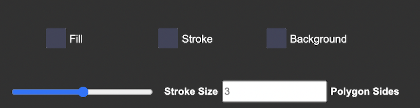
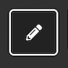

# GROUP 1 CANVAS

This is a HTML canvas containing multiple functions using JavaScript

## Get Started

First, select your color and stroke size with the selection tool shown as below

Fill: adjust the color inside your shapes
Stroke: adjust the color of the stroke or border of your shapes
Background: adjust the background of the entire canvas

Stroke Size: adjust the width of your stroke or border of your shapes
Polygon Sides: adjust the sides of your polygon, e.g. 3 = triangle

## Select your function

After you have selected your color size, 
You can decide what you want to draw on the canvas.

