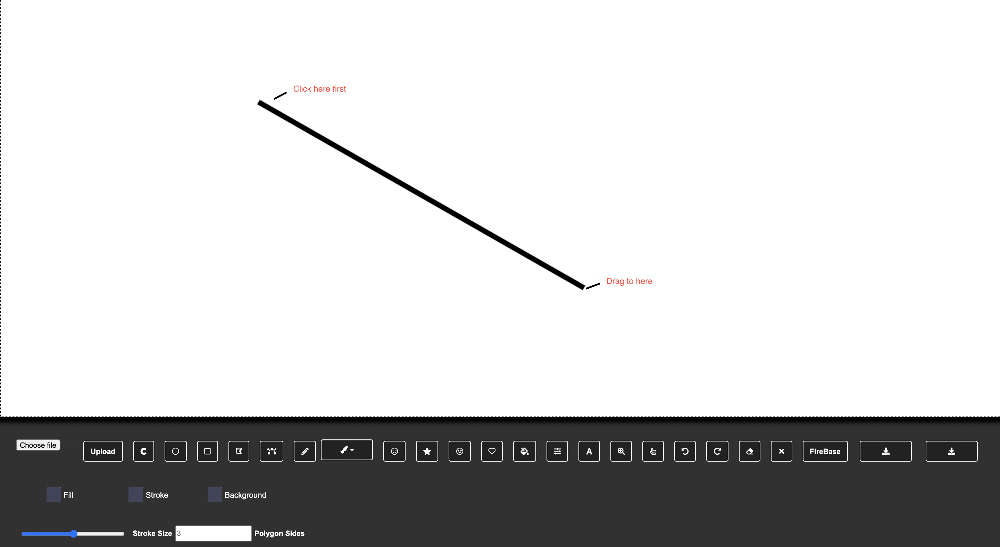
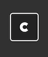
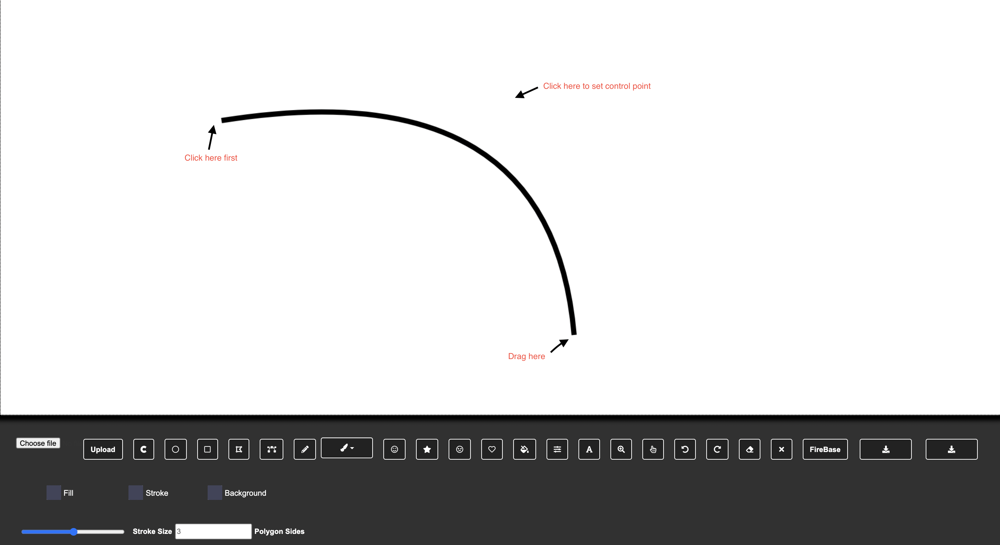
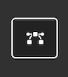
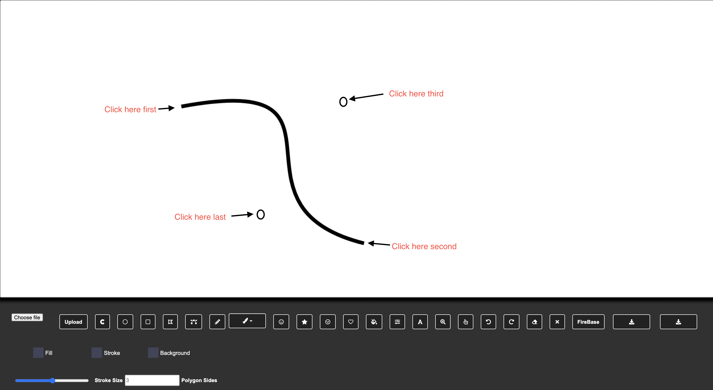
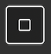
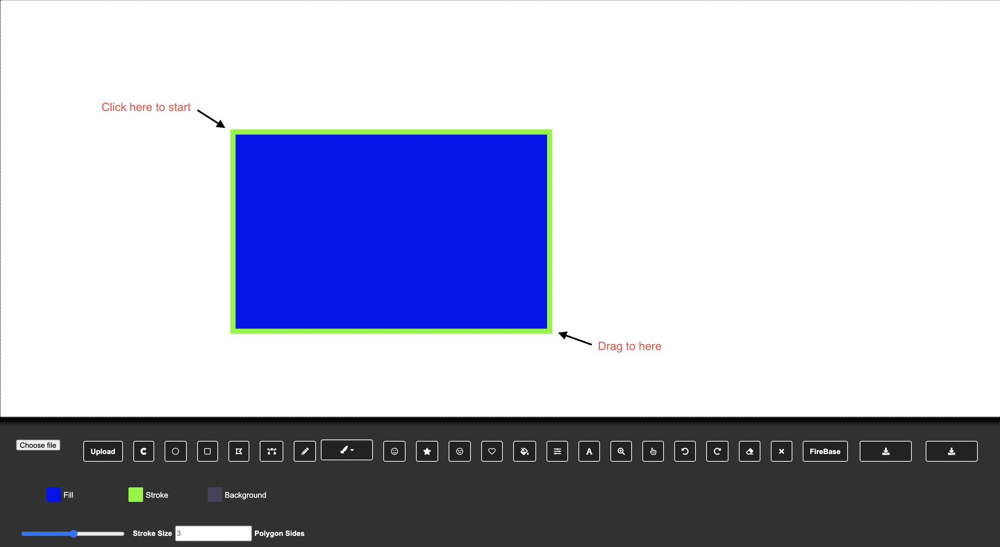
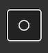

# GROUP 1 CANVAS

This is a HTML canvas containing multiple functions using JavaScript

## Get Started

First, select your color and stroke size with the selection tool shown as below

Fill: adjust the color inside your shapes  
Stroke: adjust the color of the stroke or border of your shapes  
Background: adjust the background of the entire canvas  

Stroke Size: adjust the width of your stroke or border of your shapes
Polygon Sides: adjust the sides of your polygon, e.g. 3 = triangle

## Select your function

After you have selected your color size,  
You can decide what you want to draw on the canvas.

## Line Function

  
Click on this box to select the line function  
Click on the canvas to register the starting position of the line  
Then drag your cursor to form a straight line.  
  

## Curve Function  

#### Quadratic curve  
Quadratuc curve only have one control point  

  
Click on this box to select the arc function  
Click on the canvas to register the starting position of the arc  
Click on a second location to register the ending position of the arc   
Click on the canvas for the second time to set the contorl point of the arc  
  

#### Bezier curve  
Bezier curve has two control point  

  
Click on this box to select the bezier curve function  
Click on the canvas to register the starting position of the curve  
Click on a second location to register the ending position of the curve  
Click on a third location to register the first control point  
Click on a forth location to register the second control point  
  

## Draw Rectangel  

  
Click on this box to select the rectangel function  
Click on the canvas to register the starting position of the rectangel  
Drag the cursor to form a rectangel  

## Draw Circle  

  
Click on this box to select the circle function  
Click on the canvas to register the strating position of the circle  
Drage the Cursor to form a circle  
  